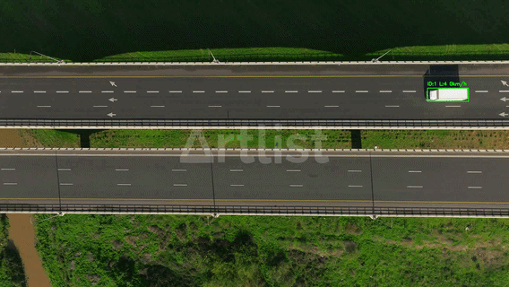
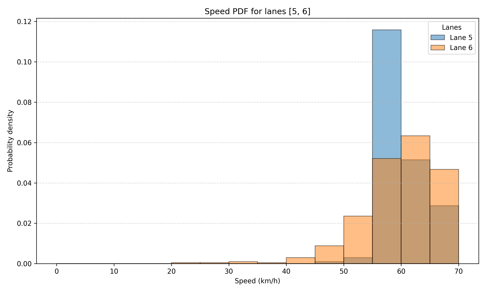

# 🏎️ AI-Powered Traffic Vision & Speed Analytics
### Real-time Vehicle Detection & Multi-Lane Tracking

This project implements a high-performance **Computer Vision** pipeline developed in **Python 3.13**. It leverages **YOLO** architecture to detect, classify, and track vehicles across multiple highway lanes while estimating their real-time speed.

## 📺 Project Demo

  

## 🎯 Core Functionalities
* **Object Detection:** Real-time identification of Cars, Vans, and Trucks using trained YOLO weights.
* **Speed Estimation:** Mathematical calculation of vehicle velocity based on frame displacement.
* **Lane Analysis:** Statistical distribution of speeds per lane using **Pandas** & **Matplotlib**.
* **Data Logging:** Every detection is logged into CSV files for post-traffic engineering analysis.

## ⚙️ Tech Stack
* **Language:** Python 3.13
* **AI Model:** YOLO (Ultralytics)
* **Libraries:** OpenCV, NumPy, Pandas, Matplotlib
* **Environment:** Structured and developed within **PyCharm**

## 📊 Speed Distribution Analysis
The system visualizes traffic flow patterns and speed probability density per lane:

  

## 🖥️ Development Environment
The project is fully configured for a Windows-based development environment using PyCharm.

  

## 📂 Project Structure
* `video_tracking_speed_lane.py`: Core processing engine for detection and tracking.
* `plot_speed_distribution_by_lane.py`: Analytics and statistical visualization script.
* `best.pt`: Pre-trained neural network weights for vehicle detection.
* `final_results.csv`: Comprehensive log of all extracted traffic telemetry.

---
*University Project - Focus: Artificial Intelligence & Data Science*
